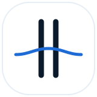
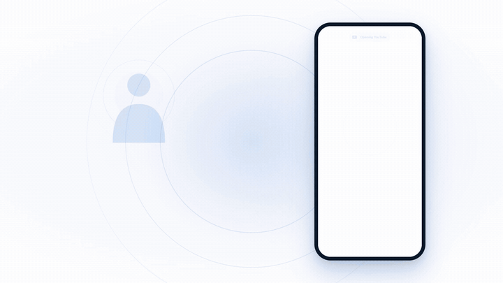
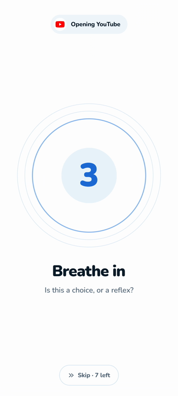
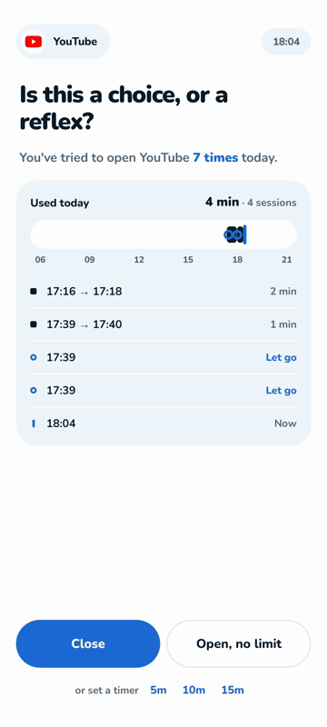
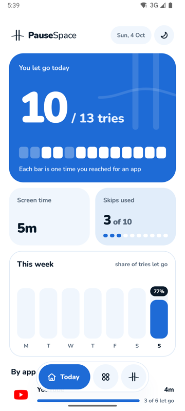
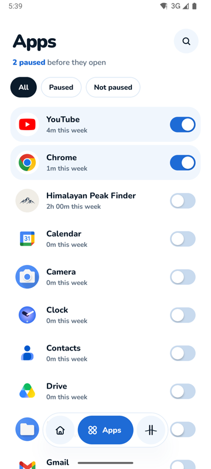
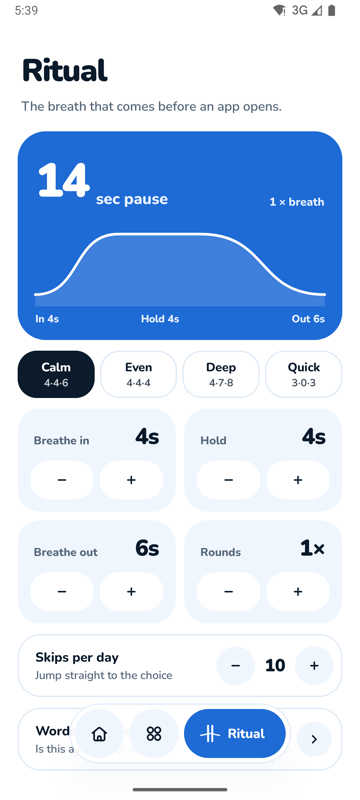

<div align="center">



# PauseSpace

**A breath of room between you and the feed.**

A calm, open-source Android app that puts a short breathing pause in front of the apps you reach for on autopilot.

[](#getting-started)
[](https://kotlinlang.org)
[](https://developer.android.com/compose)
[](#contributing)
[](https://github.com/SafalNarshing/PauseSpace/stargazers)
</div>


<div align="center">
  <video src="https://github.com/user-attachments/assets/7abe244a-d7da-4e47-8189-55d23fc06266" width="80%" controls></video>
</div>


---

## Why PauseSpace?

You open Instagram, YouTube or Reddit before you've even decided to. PauseSpace steps in at that exact moment: a calm, full-screen breathing pause appears first, then gently asks **"Is this a choice, or a reflex?"** Close it, or open it on purpose. Either way, it was *your* call.

<div align="center">
  
</div>

## Features

- 🫁 **Breathing pause** before any app you choose, with Calm, Even, Deep and Quick patterns, or your own
- 🤔 **A moment to decide**: close it, open it for 5, 10 or 15 minutes, or with no limit
- 📈 **Grows with each try**: the pause gets longer when you keep reaching for the same app
- 🗓️ **Your rules per app**: daily open limits, paused hours and check-ins when time is up
- 📊 **Today at a glance**: tries vs. let-gos, screen time and your week
- 🌗 **Light & dark**, built natively with Kotlin + Jetpack Compose
- 🔒 **Private by design**: everything stays on your phone, with no accounts and no tracking

## Screenshots

<div align="center">
  
  
  
  
  
</div>

## Getting started

```bash
git clone https://github.com/SafalNarshing/PauseSpace.git
cd PauseSpace/android
./gradlew installDebug     # build & install on a device or emulator
```

Or open the `android/` folder in Android Studio. On first launch, PauseSpace asks for three permissions: **Usage access**, **Display over apps** and **Accessibility**. It only uses them to notice when a paused app opens, never to see what you do inside it.

## Contributing

PauseSpace is **open for contributions**, and every kind of help is welcome: bug reports, ideas, design polish, translations and code.

1. Fork the repo and create a branch: `git checkout -b feature/my-idea`
2. Make your change and run the tests: `./gradlew testDebugUnitTest`
3. Open a pull request describing what changed and why

Not sure where to start? Open an [issue](https://github.com/SafalNarshing/PauseSpace/issues) and say hi.

<div align="center">
<br />
<sub>Built with care for people who want their attention back. If PauseSpace helps you, consider giving it a ⭐</sub>
</div>
